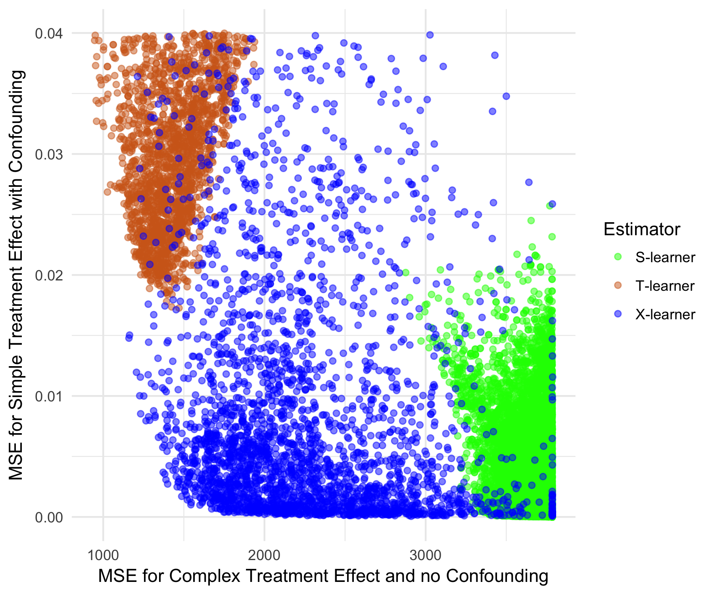

This package implements several tools for the analysis of 'heterogeneous treatment effects'. 

# Random Forest

We implement a fast, memory efficient and very adaptive version of random forest 
fore regression. 

## Usage

```{r, warning=FALSE}
library(hte)
x <- iris[, -1]; y <- iris[, 1]
# train random forest
forest <- honestRF(x, y, ntree=500, replace=TRUE, sampsize=nrow(x), mtry=3, 
                   nodesizeSpl=5, nthread=4, splitrule="variance", splitratio=.8,
                   nodesizeAvg=5)
# Test predict
y_pred <- predict(forest, x)
```

## Comparison to other well known implementations

The following image compares our new implementation (hte) with the Breiman's original 
implemenation (randomForest) and the very popular and fast implemenation from the
ranger package. 


The following images compare the prediction performance of these three implementations:


# Meta--learners

## Usage
```{r, warning=FALSE, message=FALSE}
# setting up the problem. feat are feature, tr is the treatment assignment and
# yobs is the observed outcome
feat <- iris[, -1]; tr <- rbinom(nrow(iris), 1, .5); yobs <- iris[, 1]

# 
xl <- X_RF(feat = feat, tr = tr, yobs = yobs, nthread = 8, verbose = FALSE)
sl <- S_RF(feat = feat, tr = tr, yobs = yobs, nthread = 8)
tl <- T_RF(feat = feat, tr = tr, yobs = yobs, nthread = 8)

EstimateCate(tl, feat)[1:3]

CateCI(xl, feat, B = 5, verbose = FALSE)[1:3,]
```

## Adaptivity

```{r, out.width = "690px", echo = FALSE}

```


## Performance comparison to other CATE estimators
```{r, out.width = "690px", echo = FALSE}
knitr::include_graphics("../tests/performance/CATEestimators/sim_figures/singleplot_complexTaudim20a0.png")
knitr::include_graphics("../tests/performance/CATEestimators/sim_figures/singleplot_Wager1dim20a0.png")
knitr::include_graphics("../tests/performance/CATEestimators/sim_figures/singleplot_RsparseT2weakdim20a0.png")
knitr::include_graphics("../tests/performance/CATEestimators/sim_figures/singleplot_Wager3dim20a0.png")
knitr::include_graphics("../tests/performance/CATEestimators/sim_figures/singleplot_Usual1dim20a0.png")
```


